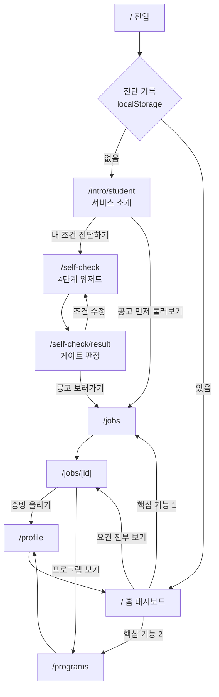

# 유저 플로우 — 유학생

> **v0.1 · 프로토타입 기준 · 2026.08.09**
>
> 대상: 유학생 한 입장만 다룹니다. 기업·대학은 인트로 페이지만 있고 앱 화면이 없어 이 문서에서 제외합니다.
> 관련 문서: [prd.md](./prd.md) · [design-system.md](./design-system.md) · [내-조건-진단-문항.md](./내-조건-진단-문항.md)

---

## 1. 이 플로우가 지키는 것

1. **로그인이 아무것도 막지 않습니다.** 프로토타입 심사·시연에서 계정 없이 전 과정을 볼 수 있어야 합니다.
2. **화면을 여는 열쇠는 진단입니다.** 로그인이 아니라 `/self-check` 완료 여부가 홈을 바꿉니다.
3. **막힌 상태도 길을 함께 보여줍니다.** 게이트가 VG-C여도 공고는 계속 볼 수 있습니다 (디자인 시스템 7장).

---

## 2. 전체 지도



---

## 3. 단계별

### 3.1 진입 — `/`

`src/app/(app)/page.tsx`가 갈림길입니다.

| 조건           | 보여줄 것                   |
| -------------- | --------------------------- |
| 진단 기록 없음 | `/intro/student`로 이동     |
| 진단 기록 있음 | `StudentHome` (홈 대시보드) |

판정 근거는 `localStorage`의 `syfity.self-check.v1` 키입니다 (`src/lib/self-check/store.ts`).

> 지금 코드는 `supabase.auth.getUser()`로 갈립니다. 5장에 바꿀 내용을 적어뒀습니다.

### 3.2 소개 — `/intro/student`

첫 방문자가 보는 화면입니다. 앱 셸(사이드바·하단탭)을 쓰지 않고 상단 바만 둡니다.

섹션 순서는 세 입장이 같습니다 — 히어로 → 지표 → 문제 → 방법 → 기능 → FAQ → 마무리 → 면책 (`src/components/intro/intro-page.tsx`).

**나가는 길 두 개**

| 버튼               | 도착          | 뜻                                               |
| ------------------ | ------------- | ------------------------------------------------ |
| 내 조건 진단하기   | `/self-check` | 본 흐름                                          |
| 공고 먼저 둘러보기 | `/jobs`       | 진단 없이 구경. 요건 판정은 "확인 필요"로 채워짐 |

상단 바의 **시작하기** 버튼도 `/self-check`로 보냅니다. 로그인으로 보내지 않습니다.

### 3.3 진단 — `/self-check`

4단계 위저드입니다. 각 단계 끝에서 저장하므로 중간에 나가도 이어서 할 수 있습니다.

| 단계 | 이름                   | 받는 것                            | 소요   |
| ---- | ---------------------- | ---------------------------------- | ------ |
| 1    | 지금 상태              | 체류자격 · 학적 · 체류 만료일      | 약 1분 |
| 2    | 내 조건                | 학력 · 어학 · 경험 · 자격증 + 증빙 | 약 2분 |
| 3    | 한국어로 할 수 있는 일 | 업무 행동 5단계                    | 약 1분 |
| 4    | 원하는 일              | 직무 · 지역 · 고용형태             | 약 1분 |

**국적을 묻지 않습니다.** 언어와 업무 행동으로 받습니다 (PR-7).
**증빙이 없으면 충족으로 넘기지 않습니다.** "확인 필요"로 남습니다 (PR-1).

### 3.4 진단 결과 — `/self-check/result`

1단계 응답으로 게이트 상태를 분류합니다 (`src/lib/self-check/gate.ts`).

| 상태 | 조건                             | 화면                        |
| ---- | -------------------------------- | --------------------------- |
| VG-A | D-10 · E-7 · F 계열              | 모든 기능                   |
| VG-B | D-2 + 졸업(예정)                 | 일부 잠김. 지원은 계속 가능 |
| VG-C | D-2 + 재학                       | 지원 잠김. 공고 열람은 가능 |
| VG-D | 필수 입력 누락 / 만료 3개월 이내 | 등록증 올리기 안내          |

시스템은 체류자격을 **판정하지 않고 분류만** 합니다. 발급 가능·불가를 단정하지 않습니다 (PR-2).

공고로 가는 경로는 **버튼 하나뿐**입니다. 카드 전체 클릭, 스크롤 자동 이동, 미리보기에서 상세 직행은 두지 않습니다.

### 3.5 홈 — `/`

진단을 마친 사람이 매일 여는 화면입니다. 두 가지만 답합니다.

```
게이트 배너 (VG-A~D)
  ↓
인사 — "고른 공고 3건에 확인 필요 3개 · 미충족 1개가 남았어요"
  ↓
핵심 기능 1 · 나에게 맞는 공고와 지원 전략
    좌: 공고 3장 (확인 필요 적은 순)
    우: 고른 공고의 강점 / 채워야 할 것 / 지원 전 할 일 1개
  ↓
핵심 기능 2 · 지금 필요한 취업지원 프로그램
    남은 요건을 채우는 프로그램 3장
  ↓
면책·출처 푸터
```

정렬은 공고 목록과 같습니다 — 확인 필요 적은 순 → 미충족 적은 순 → 충족 많은 순. 두 화면이 다른 순서를 보여주면 사용자가 같은 결과를 다르게 읽습니다.

**나가는 길**

| 위치                      | 도착         |
| ------------------------- | ------------ |
| 공고 전체 보기            | `/jobs`      |
| 요건 N개 전부 보기        | `/jobs/[id]` |
| 지원 전 할 일 → 바로 하기 | `/profile`   |
| 프로그램 전체 보기        | `/programs`  |

### 3.6 공고 목록 — `/jobs`

게이트 배너 + 조건 필터(좌) + 공고 카드(우). 모바일에서는 필터가 바텀시트입니다.

카드에는 매칭률이 없습니다. `요건 6개 · 충족 4 · 확인 필요 2`와 4색 요약 바로 말합니다.

### 3.7 공고 상세 — `/jobs/[id]`

| 블록                | 내용                                                |
| ------------------- | --------------------------------------------------- |
| 판정 요약           | 4상태 배지 + 요건 개수 + 추천 이유 + 기업 준비 상태 |
| 강점 / 채워야 할 것 | 홈 전략 패널과 같은 데이터                          |
| 요건 표             | 요건별 4상태 배지. 누르면 판정 근거가 열림          |
| 공고 원문           | 자격 요건 원문 + 해당 줄 하이라이트                 |
| 취업지원 서비스     | Work24 · 하이코리아 등 공식 기관만                  |
| 유사 공고           | 3장                                                 |

**판정만 있고 근거가 없는 행은 만들지 않습니다** (PR-1). 모든 배지 옆에 근거 칩이 붙습니다.

요건 표의 각 행에서 다음 행동으로 빠집니다 — 증빙 부족이면 `/profile`, 경험 부족이면 `/programs`.

### 3.8 프로그램 — `/programs`

상단에 "지금 채워야 할 것"(남은 요건)을 먼저 밝히고, 그것을 채우는 순서로 프로그램을 놓습니다.

추천도 %를 붙이지 않습니다. `확인 필요` → `충족` 배지 전이로 말합니다.

### 3.9 프로필·마이페이지 — `/profile`, `/mypage`

증빙을 올려 상태를 바꾸는 자리입니다. 마이페이지는 개요 / 이력서 / 서류 3개 탭입니다.

여기서 증빙을 올리면 → 요건이 `확인 필요`에서 `충족`으로 → 홈과 공고의 요약이 함께 바뀝니다. 이 되돌아오는 고리가 서비스의 핵심 루프입니다.

---

## 4. 로그인 처리 방침

**프로토타입에서는 로그인을 흐름에서 뺍니다.** 다만 페이지는 지우지 않고 남겨둡니다.

| 항목                              | 처리                                                  |
| --------------------------------- | ----------------------------------------------------- |
| `/login`, `/signup`               | 라우트 유지. 주소로 직접 열면 동작                    |
| 인트로 상단 바 "시작하기"         | `/self-check`로 연결                                  |
| 사이드바 "시작하기" (로그인 링크) | 유지 — 실제 로그인이 필요한 사람만 씀                 |
| 정보 입력                         | 로그인이 아니라 `/self-check` + `localStorage`가 담당 |
| 미들웨어                          | 손대지 않음. 이미 게스트 전면 허용                    |

**실서비스로 갈 때 바뀌는 것**

- `localStorage` 저장을 Supabase로 옮기고 RLS를 겁니다 (`store.ts` 주석에 이미 적혀 있음).
- 게이트 차단을 화면 숨김이 아니라 서버에서 강제합니다 (`gate.ts` 주석).
- 홈 분기 조건이 "진단 기록 있음"에서 "로그인 + 진단 기록 있음"으로 바뀝니다.

---

## 5. 이 문서대로 하려면 바꿔야 할 코드

| #   | 파일                                             | 지금                                          | 바꿀 것                                                        |
| --- | ------------------------------------------------ | --------------------------------------------- | -------------------------------------------------------------- |
| 1   | `src/app/(app)/page.tsx`                         | `supabase.auth.getUser()`로 분기              | 진단 기록 유무로 분기. 기록 없으면 `/intro/student`로 redirect |
| 2   | `src/components/intro/intro-header.tsx`          | "시작하기" 버튼에 `href` 없음 (TODO)          | `/self-check` 링크로                                           |
| 3   | `src/components/layout/sidebar.tsx`              | `collapsed = pathname === "/" && !isLoggedIn` | 홈이 항상 대시보드가 되므로 접기 조건 제거                     |
| 4   | `src/components/home/map-hub.tsx`                | `/`의 비로그인 화면                           | 플로우에서 제외. 파일은 남겨둠                                 |
| 5   | `src/components/onboarding/onboarding-popup.tsx` | 옛 국제기구 카피 · `92%` 적합도 배지          | 금지 패턴 위반 (PR-2). 제거하거나 다시 씀                      |

1번은 서버 컴포넌트에서 `localStorage`를 읽을 수 없으므로 클라이언트 분기가 필요합니다. 홈을 클라이언트 셸로 감싸고 `useStoredAnswers()`를 쓰는 방식이 가장 작습니다.

---

## 6. 아직 안 정한 것

| 항목                            | 상태                                                   |
| ------------------------------- | ------------------------------------------------------ |
| 기업·대학 앱 화면               | 인트로만 있음. 플로우 미설계                           |
| `/chat`, `/insight`, `/compass` | 옛 국제기구 프로젝트 화면. 유학생 플로우에 넣을지 미정 |
| `lib/i18n.ts` tagline·메뉴명    | "외교부 공공데이터 글로벌 커리어", "나침반" — 옛 문구  |
| 인트로 지표 3개                 | 전부 `pending`. 출처·기준일이 정해져야 채움 (PR-5)     |
| 실무미션                        | 요건 표에서 링크만 걸려 있고 화면 없음                 |
