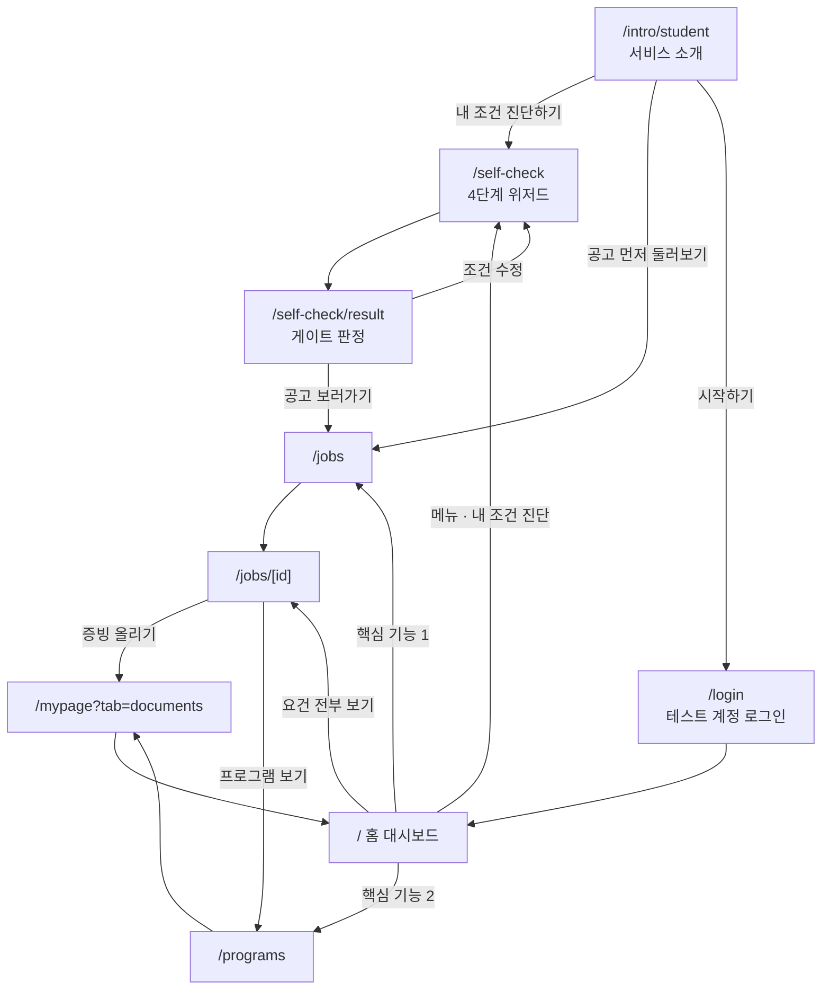

# 유저 플로우 — 유학생

> **v0.1 · 프로토타입 기준 · 2026.08.09**
>
> 대상: 유학생 한 입장만 다룹니다. 기업·대학은 인트로 페이지만 있고 앱 화면이 없어 이 문서에서 제외합니다.
> 관련 문서: [prd.md](./prd.md) · [design-system.md](./design-system.md) · [내-조건-진단-문항.md](./내-조건-진단-문항.md)

---

## 1. 이 플로우가 지키는 것

1. **아무것도 막지 않습니다.** 로그인도, 진단도 화면을 잠그지 않습니다. 프로토타입 심사·시연에서 어느 화면이든 바로 열 수 있어야 합니다.
2. **홈은 언제나 홈입니다.** 메뉴에서 홈을 누르면 항상 맞춤 공고와 맞춤 프로그램이 나옵니다. 조건에 따라 다른 화면이 뜨지 않습니다.
3. **진단은 정확도를 올립니다.** 안 해도 쓸 수 있고, 하면 요건 판정이 내 조건에 맞게 바뀝니다.
4. **막힌 상태도 길을 함께 보여줍니다.** 게이트가 VG-C여도 공고는 계속 볼 수 있습니다 (디자인 시스템 7장).

---

## 2. 전체 지도



---

## 3. 단계별

### 3.1 진입 — `/`

**`/`는 언제나 홈 대시보드입니다.** 진단 여부로도, 로그인 여부로도 가르지 않습니다.

메뉴에서 홈을 누르면 맞춤 공고와 맞춤 프로그램이 바로 나옵니다. 앱 안을 돌다가 홈으로 돌아왔는데 서비스 소개가 뜨면 길을 잃습니다.

서비스 소개(`/intro/student`)는 별도 주소로만 엽니다. 첫 방문자에게 보낼 링크로 씁니다.

> 진단을 하지 않아도 홈은 열립니다. 다만 진단 전에는 요건이 대부분 "확인 필요"로 남아 있어, 진단을 마쳐야 판정이 실제 조건에 맞게 바뀝니다.

### 3.2 소개 — `/intro/student`

첫 방문자가 보는 화면입니다. 앱 셸(사이드바·하단탭)을 쓰지 않고 상단 바만 둡니다.

섹션 순서는 세 입장이 같습니다 — 히어로 → 지표 → 문제 → 방법 → 기능 → FAQ → 마무리 → 면책 (`src/components/intro/intro-page.tsx`).

**나가는 길 두 개**

| 버튼               | 도착          | 뜻                                               |
| ------------------ | ------------- | ------------------------------------------------ |
| 내 조건 진단하기   | `/self-check` | 본 흐름                                          |
| 공고 먼저 둘러보기 | `/jobs`       | 진단 없이 구경. 요건 판정은 "확인 필요"로 채워짐 |

상단 바의 **시작하기** 버튼은 `/login`으로 갑니다. 거기에 테스트 계정 버튼이 있습니다 (5.1).

### 3.3 진단 — `/self-check`

4단계 위저드입니다. 각 단계 끝에서 저장하므로 중간에 나가도 이어서 할 수 있습니다.

| 단계 | 이름                   | 받는 것                            | 소요   |
| ---- | ---------------------- | ---------------------------------- | ------ |
| 1    | 지금 상태              | 체류자격 · 학적 · 체류 만료일      | 약 1분 |
| 2    | 내 조건                | 학력 · 어학 · 경험 · 자격증 + 증빙 | 약 2분 |
| 3    | 한국어로 할 수 있는 일 | 업무 행동 5단계                    | 약 1분 |
| 4    | 원하는 일              | 직무 · 지역 · 고용형태             | 약 1분 |

**국적을 묻지 않습니다.** 언어와 업무 행동으로 받습니다 (PR-7).
**증빙이 없으면 충족으로 넘기지 않습니다.** "확인 필요"로 남습니다 (PR-1).

### 3.4 진단 결과 — `/self-check/result`

1단계 응답으로 게이트 상태를 분류합니다 (`src/lib/self-check/gate.ts`).

| 상태 | 조건                             | 화면                        |
| ---- | -------------------------------- | --------------------------- |
| VG-A | D-10 · E-7 · F 계열              | 모든 기능                   |
| VG-B | D-2 + 졸업(예정)                 | 일부 잠김. 지원은 계속 가능 |
| VG-C | D-2 + 재학                       | 지원 잠김. 공고 열람은 가능 |
| VG-D | 필수 입력 누락 / 만료 3개월 이내 | 등록증 올리기 안내          |

시스템은 체류자격을 **판정하지 않고 분류만** 합니다. 발급 가능·불가를 단정하지 않습니다 (PR-2).

공고로 가는 경로는 **버튼 하나뿐**입니다. 카드 전체 클릭, 스크롤 자동 이동, 미리보기에서 상세 직행은 두지 않습니다.

### 3.5 홈 — `/`

매일 여는 화면입니다. 두 가지만 답합니다.

```
게이트 배너 (VG-A~D)
  ↓
인사 — "고른 공고 3건에 확인 필요 3개 · 미충족 1개가 남았어요"
  ↓
핵심 기능 1 · 나에게 맞는 공고와 지원 전략
    좌: 공고 3장 (확인 필요 적은 순)
    우: 고른 공고의 강점 / 채워야 할 것 / 지원 전 할 일 1개
  ↓
핵심 기능 2 · 지금 필요한 취업지원 프로그램
    남은 요건을 채우는 프로그램 3장
  ↓
면책·출처 푸터
```

정렬은 공고 목록과 같습니다 — 확인 필요 적은 순 → 미충족 적은 순 → 충족 많은 순. 두 화면이 다른 순서를 보여주면 사용자가 같은 결과를 다르게 읽습니다.

**나가는 길**

| 위치                      | 도착                    |
| ------------------------- | ----------------------- |
| 공고 전체 보기            | `/jobs`                 |
| 요건 N개 전부 보기        | `/jobs/[id]`            |
| 지원 전 할 일 → 바로 하기 | `/mypage?tab=documents` |
| 프로그램 전체 보기        | `/programs`             |

### 3.6 공고 목록 — `/jobs`

게이트 배너 + 조건 필터(좌) + 공고 카드(우). 모바일에서는 필터가 바텀시트입니다.

카드에는 매칭률이 없습니다. `요건 6개 · 충족 4 · 확인 필요 2`와 4색 요약 바로 말합니다.

### 3.7 공고 상세 — `/jobs/[id]`

| 블록                | 내용                                                |
| ------------------- | --------------------------------------------------- |
| 판정 요약           | 4상태 배지 + 요건 개수 + 추천 이유 + 기업 준비 상태 |
| 강점 / 채워야 할 것 | 홈 전략 패널과 같은 데이터                          |
| 요건 표             | 요건별 4상태 배지. 누르면 판정 근거가 열림          |
| 공고 원문           | 자격 요건 원문 + 해당 줄 하이라이트                 |
| 취업지원 서비스     | Work24 · 하이코리아 등 공식 기관만                  |
| 유사 공고           | 3장                                                 |

**판정만 있고 근거가 없는 행은 만들지 않습니다** (PR-1). 모든 배지 옆에 근거 칩이 붙습니다.

요건 표의 각 행에서 다음 행동으로 빠집니다 — 증빙 부족이면 `/mypage?tab=documents`, 경험 부족이면 `/programs`.

### 3.8 프로그램 — `/programs`

상단에 "지금 채워야 할 것"(남은 요건)을 먼저 밝히고, 그것을 채우는 순서로 프로그램을 놓습니다.

추천도 %를 붙이지 않습니다. `확인 필요` → `충족` 배지 전이로 말합니다.

### 3.9 마이페이지 — `/mypage`

증빙을 올려 상태를 바꾸는 자리입니다. 개요 / 이력서 / 서류 3개 탭이고, 증빙 업로드는 서류 탭(`/mypage?tab=documents`)입니다.

> 예전에는 `/profile`이 따로 있었지만 나침반(`/compass`) 라이브러리 위에 얹혀 있어 함께 지웠습니다. 증빙 링크는 전부 마이페이지 서류 탭으로 갑니다.

여기서 증빙을 올리면 → 요건이 `확인 필요`에서 `충족`으로 → 홈과 공고의 요약이 함께 바뀝니다. 이 되돌아오는 고리가 서비스의 핵심 루프입니다.

---

## 4. 메뉴

메뉴는 플로우 순서를 그대로 따릅니다 (`src/lib/nav.ts`).

| 순서 | 라벨         | 경로          | 하단 탭 라벨 |
| ---- | ------------ | ------------- | ------------ |
| 1    | 홈           | `/`           | 홈           |
| 2    | 내 조건 진단 | `/self-check` | 진단         |
| 3    | 공고         | `/jobs`       | 공고         |
| 4    | 역량 강화    | `/growth`     | 역량 강화    |

- 역량 강화는 허브입니다. 카드로 프로그램(`/programs`)·문화·언어 시뮬레이션(`/simulation`)·직무 테스트(준비 중)를 고릅니다.
- 마이페이지는 사이드바 아래 계정 영역에 있습니다. 모바일 하단 탭에는 5번째 칸으로 넣습니다 — 증빙을 올리는 자리가 핵심 루프라서입니다.
- 하단 탭은 10px 5칸이라 긴 이름이 들어가지 않습니다. `shortLabelKey`로 짧은 라벨을 따로 둡니다.
- 홈의 활성 표시는 `pathname === "/"`일 때만입니다. `startsWith`로 보면 모든 경로가 홈에 걸립니다.

**지운 화면**

| 경로       | 대신 쓰는 곳                         |
| ---------- | ------------------------------------ |
| `/compass` | `/self-check` (내 조건 진단)         |
| `/profile` | `/mypage?tab=documents` (마이페이지) |

`src/components/compass/`, `src/lib/compass/`, `src/components/profile/`도 함께 지웠습니다.

**메뉴에서 뺀 것**

| 경로       | 이유                                                        |
| ---------- | ----------------------------------------------------------- |
| `/chat`    | 옛 국제기구 프로젝트 챗봇. 카피에 "적합도"가 있어 PR-2 위반 |
| `/insight` | 옛 백엔드(`lib/api/iogo.ts`)를 호출. 유학생 취업과 무관     |

둘 다 라우트는 살아 있어 주소로 직접 열 수 있습니다.

상단 로고 옆 tagline은 `외국인 취업 플랫폼`입니다 (`src/lib/i18n.ts`).

---

## 5. 로그인 처리 방침

**로그인은 어떤 화면도 막지 않습니다.** 계정 없이도 전 과정을 볼 수 있고, 로그인은 저장·마이페이지처럼 계정이 필요한 기능을 켜는 용도입니다.

| 항목                      | 처리                                                  |
| ------------------------- | ----------------------------------------------------- |
| 인트로 상단 바 "시작하기" | `/login`                                              |
| 사이드바 "시작하기"       | `/login`                                              |
| 인트로 히어로 CTA         | "내 조건 진단하기" → `/self-check`                    |
| 정보 입력                 | 로그인이 아니라 `/self-check` + `localStorage`가 담당 |
| 미들웨어                  | 손대지 않음. 이미 게스트 전면 허용                    |

### 5.1 시연용 테스트 계정

로그인 화면의 소셜 로그인 버튼 아래에 **테스트 계정으로 로그인하기** 버튼이 있습니다. 소셜 버튼과 같은 모양(`SocialButton`)이라 같은 줄로 읽힙니다. 심사·발표에서 매번 가입하지 않으려는 것입니다.

**쓰려면 두 가지가 필요합니다.**

1. Supabase 대시보드 → Authentication → Users에서 시연용 계정을 하나 만듭니다.
2. `.env`에 같은 값을 넣습니다.

```
NEXT_PUBLIC_DEMO_EMAIL=demo@globable.kr
NEXT_PUBLIC_DEMO_PASSWORD=...
```

버튼은 값이 없어도 항상 보입니다. 준비가 안 된 상태로 누르면 무엇을 채워야 하는지 알려줍니다.

> ⚠️ `NEXT_PUBLIC_` 값은 브라우저 번들에 그대로 들어갑니다. 시연 전용 계정만 넣고, 실제 사용자 데이터가 있는 계정은 쓰지 않습니다.

구현: `src/components/auth/demo-login-button.tsx` — `signInWithPassword` 후 `/`로 보냅니다.

**실서비스로 갈 때 바뀌는 것**

- `localStorage` 저장을 Supabase로 옮기고 RLS를 겁니다 (`store.ts` 주석에 이미 적혀 있음).
- 게이트 차단을 화면 숨김이 아니라 서버에서 강제합니다 (`gate.ts` 주석).
- 홈이 로그인 여부를 보게 됩니다. 지금은 보지 않습니다.

---

## 6. 적용된 코드 변경

> 2026.08.09 적용 완료.

| #   | 파일                                                                    | 바뀐 것                                                                                                  |
| --- | ----------------------------------------------------------------------- | -------------------------------------------------------------------------------------------------------- |
| 1   | `src/app/(app)/page.tsx`                                                | 분기를 전부 걷어내고 `StudentHome` 하나만 렌더                                                           |
| 2   | `src/components/intro/intro-header.tsx`                                 | "시작하기"가 `href` 없는 `button` → `/login` `Link`                                                      |
| 3   | `src/components/layout/sidebar.tsx`                                     | `collapsed` 로직 제거. 항상 244px로 펼침                                                                 |
| 4   | `src/components/home/map-hub.tsx`                                       | 렌더 제거. 파일 상단에 "플로우에서 제외" 주석                                                            |
| 5   | `src/components/onboarding/onboarding-popup.tsx`                        | 렌더 제거. 파일 상단에 제외 사유(`92%` 배지 · 옛 카피) 주석                                              |
| 6   | `src/lib/nav.ts`                                                        | 메뉴를 홈 / 진단 / 공고 / 프로그램으로 교체. `shortLabelKey` 추가                                        |
| 7   | `src/lib/i18n.ts`                                                       | tagline을 `외국인 취업 플랫폼`으로. 메뉴 라벨 키 정리                                                    |
| 8   | `src/components/layout/bottom-nav.tsx`                                  | 짧은 라벨 사용. `isActive`에서 홈(`/`) 예외 처리                                                         |
| 9   | `src/components/auth/demo-login-button.tsx`                             | **신규.** 시연용 테스트 계정 로그인. `SocialButton` 모양으로 항상 노출                                   |
| 10  | `src/app/(auth)/login/page.tsx`                                         | 소셜 로그인 버튼 3개 주석 처리. 테스트 계정 버튼만 남김                                                  |
| 11  | `src/components/jobs/detail/requirement-disclosure.tsx`                 | **신규.** 요건별 상태 보기 버튼. 누르면 확인 단계 3개 + 스켈레톤을 거쳐 요건 표·강점·채워야 할 것이 열림 |
| 12  | `src/components/jobs/job-detail-client.tsx`                             | 요건 표와 강점 카드를 직접 부르던 자리를 `RequirementDisclosure`로 교체                                  |
| 13  | `src/app/(app)/compass/`, `src/components/compass/`, `src/lib/compass/` | **삭제.** 나침반은 `/self-check`로 대체됐다                                                              |
| 14  | `src/app/(app)/profile/`, `src/components/profile/`                     | **삭제.** compass 라이브러리에 의존하던 화면. `/mypage`가 대신한다                                       |
| 15  | `src/lib/feed/detail-mock.ts`                                           | 증빙 링크 `/profile` → `/mypage?tab=documents` (3곳)                                                     |
| 16  | `src/components/insight/insight-client.tsx`                             | 죽은 `/compass` 링크를 `/self-check`로                                                                   |
| 17  | `src/lib/self-check/gate.ts`                                            | 기능 키 `compass` → `selfCheck` (라벨은 그대로)                                                          |

4·5번 파일은 지우지 않았습니다. 다시 쓰려면 카피부터 새로 써야 한다는 사실을 파일 안에 남겨뒀습니다.

**홈으로 돌아오는 길** — 앱 헤더 로고와 메뉴 첫 항목이 모두 `/`로 갑니다. 어느 쪽을 눌러도 대시보드가 나옵니다.

---

## 7. 아직 안 정한 것

| 항목                         | 상태                                                   |
| ---------------------------- | ------------------------------------------------------ |
| 기업·대학 앱 화면            | 인트로만 있음. 플로우 미설계                           |
| `/chat`, `/insight`          | 옛 국제기구 프로젝트 화면. 유학생 플로우에 넣을지 미정 |
| `lib/i18n.ts` tagline·메뉴명 | "외교부 공공데이터 글로벌 커리어", "나침반" — 옛 문구  |
| 인트로 지표 3개              | 전부 `pending`. 출처·기준일이 정해져야 채움 (PR-5)     |
| 실무미션                     | 요건 표에서 링크만 걸려 있고 화면 없음                 |
